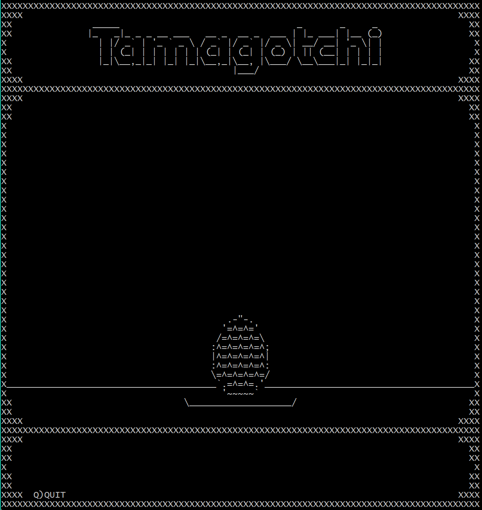
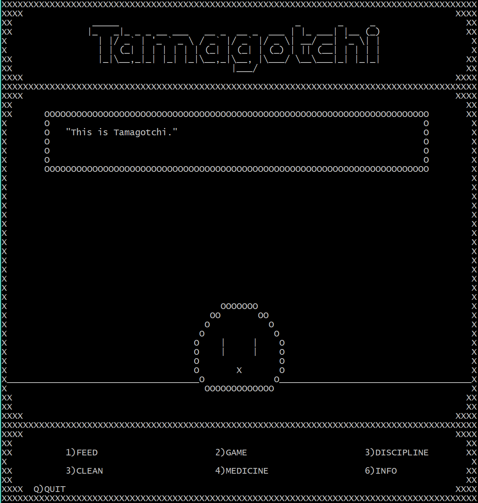
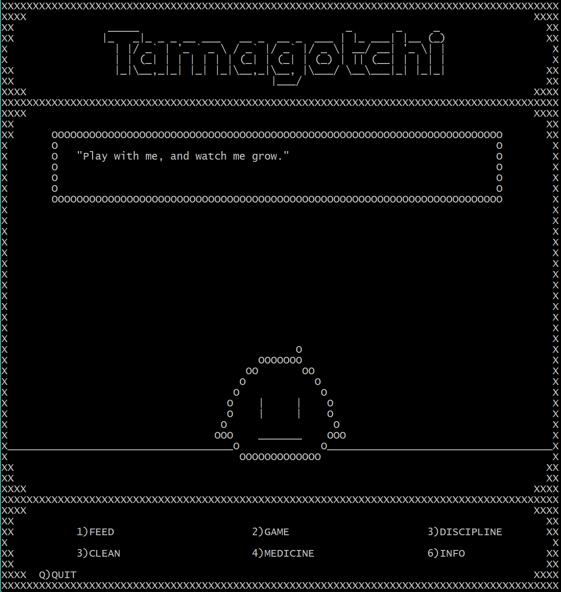
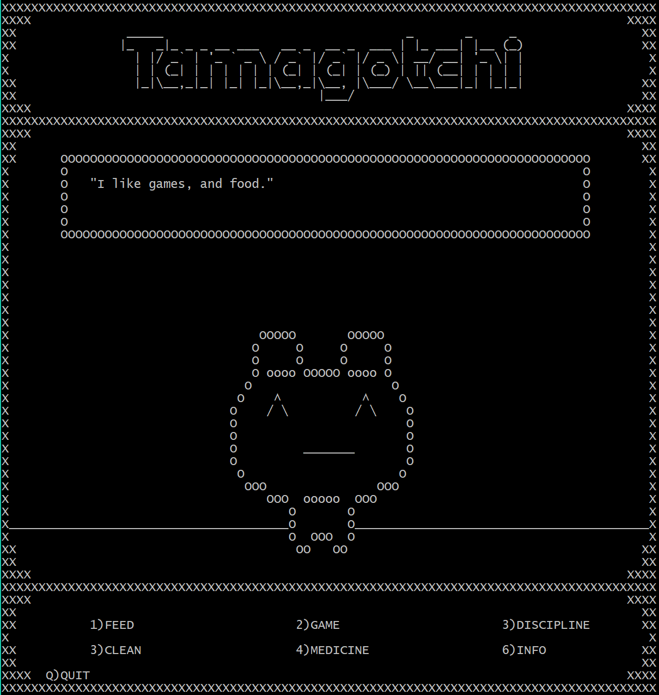
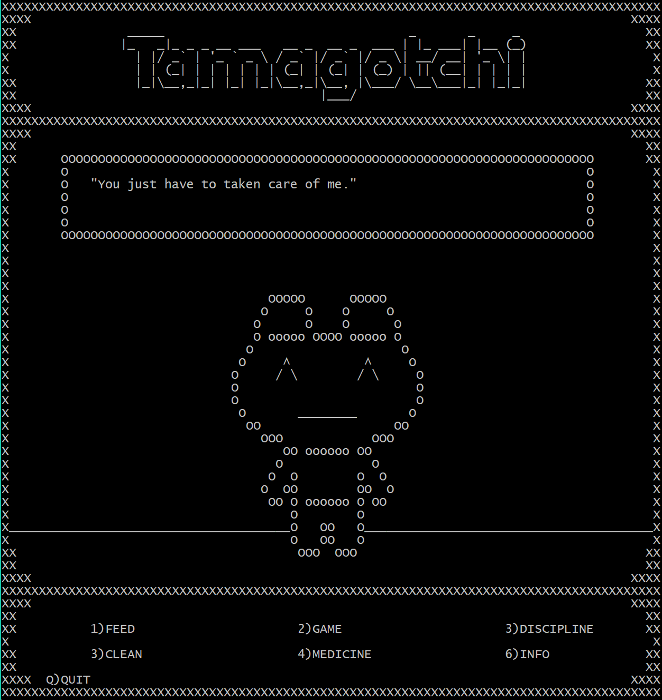
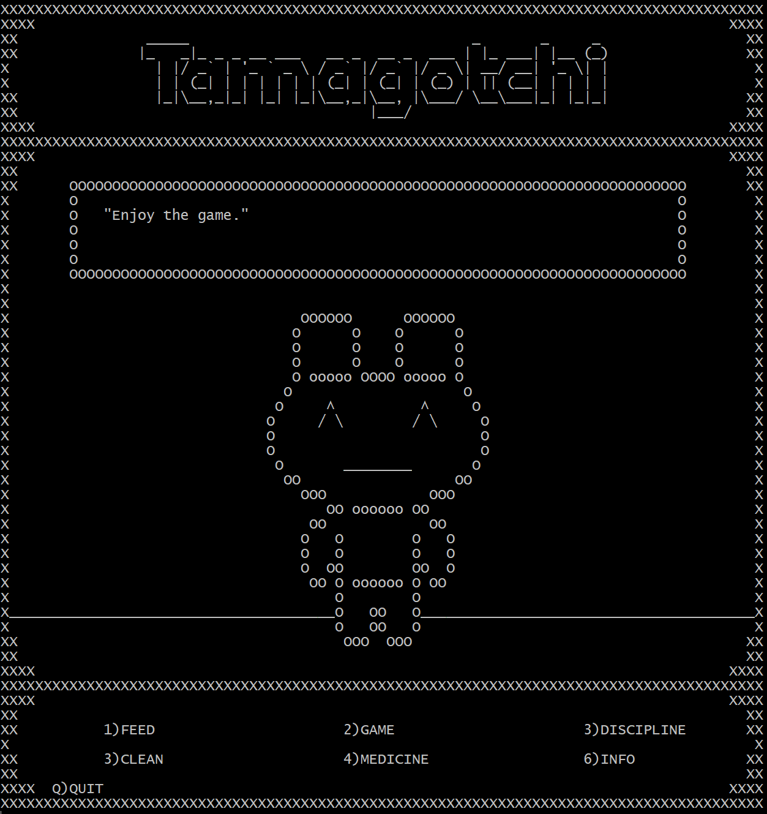
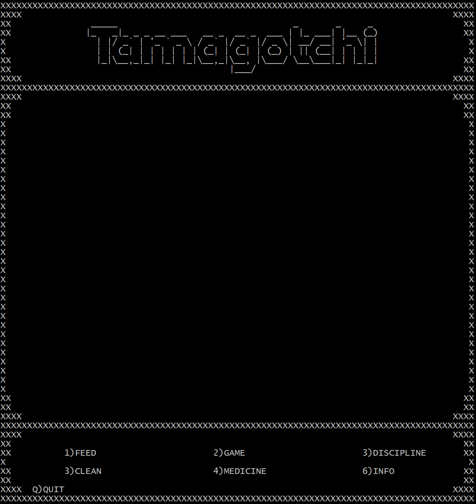
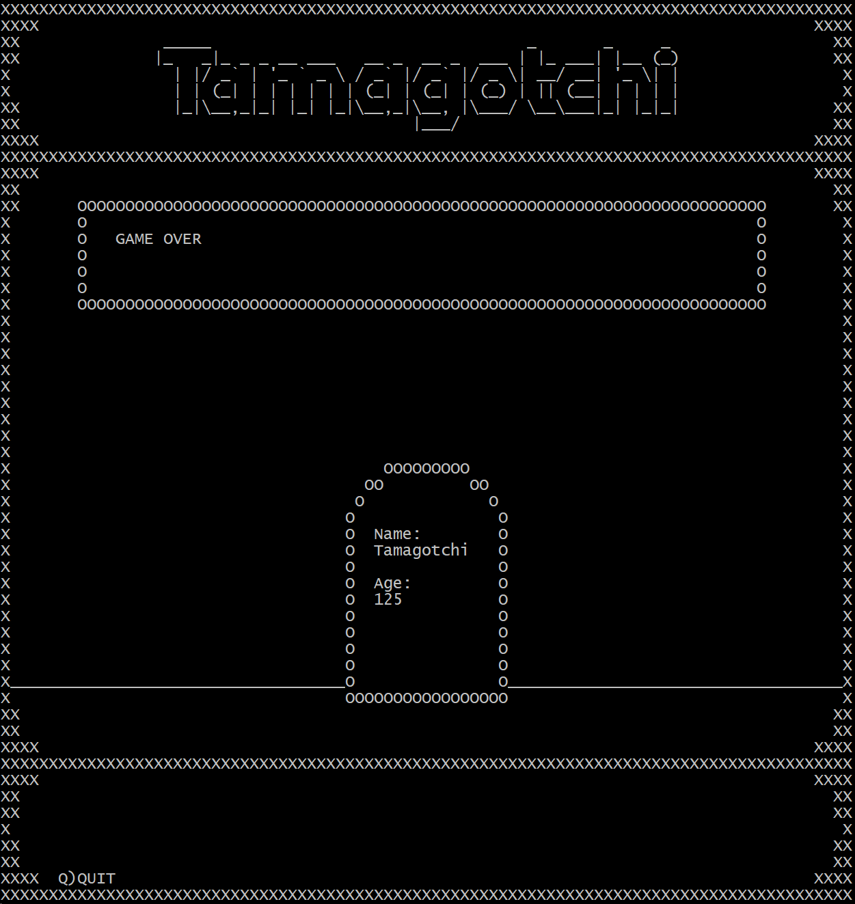

Tamagotchi is a game where the player takes care of a virtual pet. This game is played in real-time, and can change while you are not watching it. The goal of the game is for the pet to grow up and move out. The pet can be fed, played with, and cleaned. Making sure that the pet is happy, fed, and clean easily leads to the pet aging properly. If the player does not take of the pet properly, it will get sick and needs to be given medicine, or can eventually die. Some of the situations that will cause the pet to get sick are: not cleaning it, not feeding it, and feeding it too much. If ignored for too long, the pet will die and the game will display a gravestone. It can also die if it given too much medicine. 

For this project, my group of three members made a simplified version of this game. For instance, our game's "clock" changes with each action the player takes rather than with real-time. Additionally, the time that needs to pass for the pet to grow up is much shorter. We separated the work load into the following sections: created the classes to manage the tamagotchi, creating the display and user interface, and creating a main function that calls the functions and manipulates the data from the other two section. My main contribution for this project was designing the display and user interface. We decided that it would be best to create the dispay using ASCII rather than a GUI interface like ncurses. To have better control over the display, we split it into different sections. These sections were: titleblock, dialogue, character, and user interface. The titleblock only displays the "Tamagotchi" title and never really changes, but we separated it from the dialogue display because there are times when we show or hide the dialogue box. The dialogue display was made by using three arrays of a set length. It is initialized to all spaces so that we can display a blank dialogue box, and the cells is changed  to display messages to the player. Alternatively, that section can be replaced by a blank with just the borders of the display showing. The character display changes between different ASCII pictures that represent the age progression of the pet. There is also a display to turn off the lights in the pet's room to make the display mostly blank. The user interface display shows all the actions that user do, and can be replaced by an alternative display that shows the information (happiness, hunger, age, etc.) of the pet.

  

    
    
    
    
  

  <figcaption>1.Egg   2.Baby    3.Kid   4.Teen</figcaption>
  

    
    
    
    
  

  <figcaption>5.Adult   6.Parent    7.Lights off    8.Grave</figcaption>

